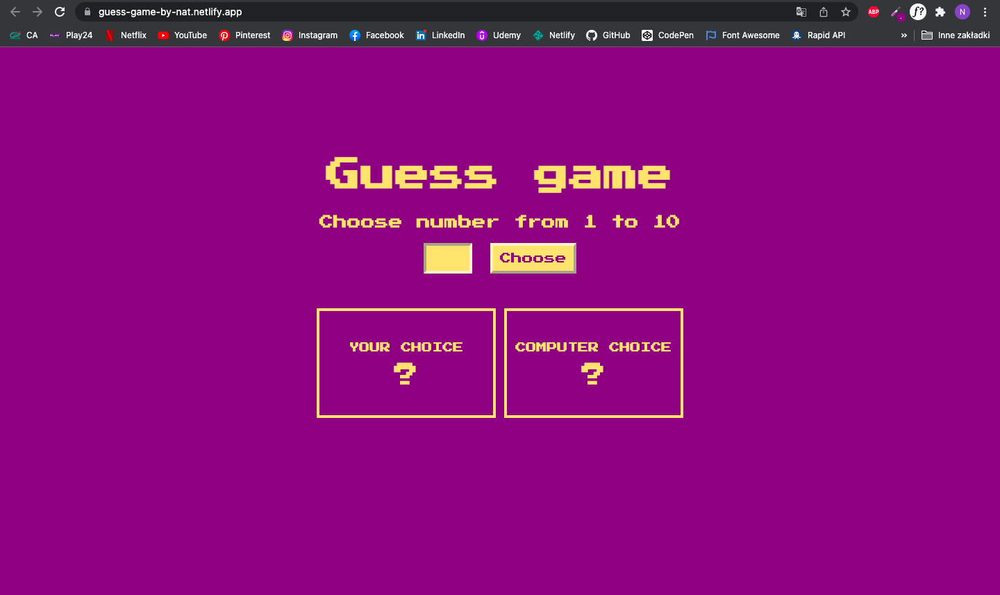

# guess-game
### Simple guess game built with JavaScript

## This web page is hosted here!
> https://guess-game-by-nat.netlify.app/

## Table of Contents
* [General Info](#general-information)
* [Technologies Used](#technologies-used)
* [Features](#features)
* [Screenshots](#screenshots)
* [Project Status](#project-status)
* [Sources](#sources)
* [Author](#author)

## General Information
Simple guess game built with Vanilla JavaScript with retro game interface.

## Technologies Used
* HTML5
* CSS3
* Vanilla JavaScript

## Features
* Input asks for a number from 1 to 10
* App shows your choice and hints
* App shows computer choice and information "You won!" when your guess was correct
* Retro Game Interface
* Responsive on all devices

## Screenshots

## Project status
Project is: _no longer being worked on_ 

## Sources
* Font: Press Start 2P by [Google Fonts](https://fonts.google.com/specimen/Press+Start+2P?query=press)
* Designed by me

## Author
Created by [Nat Stopa](https://natstopa-portfolio.netlify.app/)
